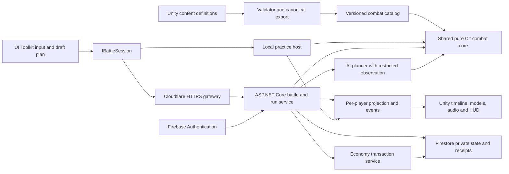

# Fighting Allstar — first prototype architecture

Date: 2026-10-01. This is a proposed implementation plan, based on a read-only repository audit and the owner's design request. No runtime implementation, package installation, cloud provisioning, or build was performed for this document.

Design authority: [GDD](../../1_Inputs_Templates/GDD_Fighting_Allstar.md), especially `@tag:mechanics`, `@tag:architecture`, and `@tag:roadmap`. The GDD owns combat and progression rules; this plan specifies how to implement and verify them. Related: [task card](fighting-allstar-prototype-task-card.md), [ADR-001](../ADRs/001-authoritative-combat-core.md), [test plan](../TestPlans/fighting-allstar-prototype-test-plan.md).

## 1. Recommended first deliverable

Build a complete small vertical slice: MainMenu → choose a legal team → select a linear dungeon → sequential stages against randomized character teams → 3 active plus 1 reserve card battles → victory or defeat → authoritative reward receipt → roster/summon/constellation → another run. Start with four onboarding fighters, then reach the GDD's eight-fighter and three-dungeon-profile acceptance scope through shared effects. Owned characters begin at C0/6 and can receive six upgrades through C6/6. Online PvE is required for prototype completion. A private two-client battle proves the same authority boundary for PvP; ranked ladders and public matchmaking remain later work.

Use one deterministic C# combat library in both the local development harness and the online battle service. Unity owns input and presentation. The server owns battle truth, RNG, run eligibility, ownership, and currency. A local/network switch changes the transport and authority host; it does not swap rule implementations.

Add an ASP.NET Core container service as a **proposed hosting addition** to the requested Unity/Firebase/Cloudflare stack. Default host: Google Cloud Run, behind a Cloudflare HTTPS gateway. Firebase supplies identity and Firestore storage. This is a recommendation pending architecture review; cloud accounts, regions, service limits, operating cost, and deployment credentials are not established project facts.

## 2. What actually exists

Audit scope: the named project scripts, `Packages/manifest.json`, `ProjectSettings/ProjectVersion.txt`, `EditorBuildSettings.asset`, and targeted file searches. Code was read; scene wiring and playability were not run or certified.

| Existing path | Observed implementation | Migration implication |
|---|---|---|
| `ProjectSettings/ProjectVersion.txt` | Unity `6000.3.4f1` | Keep this editor baseline for the prototype; an upgrade is a separate decision. |
| `Packages/manifest.json` | Input System `1.17.0`, UGUI `2.0.0`, UIElements module; no Firebase package listed | UI Toolkit engine support exists, but SDK/service integration is still work. |
| `Assets/Scenes/` and `EditorBuildSettings.asset` | Five enabled scenes: CharacterLoadOut, CharacterProfile, Gacha, BattleGame, Test, all with `Scene-` prefix | Desired `MainMenu` and `Combat` scenes are not yet present. |
| `Assets/Script/Gameplay/BattleManager.cs` | Setup, spawning, CC comparison, intro, initial player deck; duplicate CC calculation; turn-manager handoff left as comment | Reuse visual sequence intent; replace authoritative orchestration. |
| `Assets/Script/Gameplay/GameManager.cs` | Separate legacy unit scheduler, tag lookups, random enemy Skill1/Skill2 | Cannot be the new team-turn authority alongside BattleManager. |
| `Assets/Script/Gameplay/Unit.cs` | HP, PG, damage, healing, death, animator, HUD, and delayed next-turn calls combined | Split combat state from `FighterView`; animation callbacks must lose rule authority. |
| `Assets/Script/Gameplay/TeamDataManager.cs` | `IBattleDataProvider`, saved local team, random enemy team, model spawning, local player reserve swap | Preserve asset/spawn mappings; replace mixed ownership with explicit team IDs and per-team state. |
| `Assets/Script/Gameplay/Interfaces/IBattleDataProvider.cs` | Returns `TransferTeamData` containing `CharacterObject` references | Useful migration seam, but not a network DTO or session protocol. |
| `Assets/Script/Card/CardDeckManager.cs` | Mutable player hand/action list; hand size from team count plus three; random draws and hand reorder | Replace logic with GDD rules for both sides; merge, reset, and committed turn resolution are not demonstrated here. |
| `Assets/Script/Card/RuntimeCard.cs` | `Guid.NewGuid()`, `Unit` owner, SO card reference, rank | Replace with stable serializable runtime IDs and definition IDs. |
| `Assets/Script/Card/SkillCardSO.cs`, `UltimateCardSO.cs` | Rank/level records, types, multipliers, GameObject effect references | Preserve authored media; export pure typed effect definitions. |
| `Assets/Prefab/ScriptableObject/Character/` and `Skill&Ultimate/` | Existing named fighter assets include Kyo94, Beni94, Goro94, Shingo94, Yuri94, Ryo94, Mai95, Athena95 and Beni99, with legacy IDs 0–8; inspected fighters share a model GUID. Kyo skill ranks serialize as 0/1/2 while the accessor expects public 1/2/3; multipliers include 180/230/300 while code comments describe decimal factors. | Existing assets are migration input, not verified complete kits. Preserve legacy ID 0 and explicitly map ranks/units; do not interpret 180 as 180 times ATK. |
| `Assets/Script/Character/CharacterObject.cs` | Source stats, visuals, skills, rarity, attribute mixed with serialized level/awakening/ultimate progression | Separate immutable content from player-owned progress. |
| `Assets/Script/Gameplay/ActionScript.cs` | Unity RNG, damage, crit/block, PG, animation and delayed life drain | Replace calculation; retain compatible animation presentation after audit. |
| `Assets/Script/Inventory/PlayerCharacterRoster.cs` | Empty class | Persistent roster is new work. |
| `Assets/Script/Inventory/InventoryObject.cs` | SO list of characters; deduplicates by display name | Reuse as an authoring catalog only; never treat as online inventory. |
| `Assets/Script/Gacha/GachaManager.cs` | Client RNG summons and local result visuals | Keep eligible art/layout; move rolls and economic mutation to server. |
| `Assets/Script/UI/`, `Assets/Script/Card/SkillCard.cs` | UGUI/TMP and drag handlers | Rebuild prototype screens in UI Toolkit through presenters. |
| `Assets/LeanTween/` | LeanTween source present | Reuse for visual timing; no combat decisions in tween completion callbacks. |

Targeted searches found no project C# assembly boundaries, project UXML/USS, Firebase/Cloudflare network layer, deterministic replay suite, or dedicated project combat test suite. Vendor LeanTween examples/tests exist. Absence is reported within that inspected scope, not as a guarantee about every file on disk. UnityMCP is an editor automation tool, not a runtime server component.

## 3. Target boundaries



All arrows into the core carry plain immutable definitions, value state, or commands. No `MonoBehaviour`, `Transform`, `Animator`, `ScriptableObject`, `UnityEngine.Random`, wall clock, scene lookup, network call, or storage call belongs inside it. Core events describe results; they never call UI components.

### Proposed source layout

These paths are plans, not created code. Existing asset GUIDs and `.meta` files must be preserved during migration.

```text
Shared/FightingAllstar.Core/
  Combat/       # state, commands, validation, resolution, effects, projections
  Content/      # typed catalog DTOs, schema validation
  Dungeon/      # seeded linear stages, opposing team generation and validators
  AI/           # legal action generation, evaluation, bounded search
  Replay/       # canonical serialization, event replay, known-answer vectors
  FightingAllstar.Core.csproj  # targets netstandard2.1
Server/FightingAllstar.Server/
  Api/ Auth/ Matches/ Runs/ Economy/ Persistence/
Tests/FightingAllstar.Core.Tests/
Tests/FightingAllstar.Server.Tests/
Assets/_Project/
  Core/Bootstrap/ Core/GameFlow/ Core/Services/
  Gameplay/Combat/Presentation/ Gameplay/Dungeon/Presentation/
  Content/Characters/ Content/Cards/ Content/Dungeons/
  UI/MainMenu/ UI/Combat/ UI/Shared/
  Tools/ContentExport/ Tests/EditMode/ Tests/PlayMode/
  Plugins/FightingAllstar.Core.dll
  Scenes/MainMenu.unity
  Scenes/Combat.unity
```

The DLL is built from `Shared/` and imported as a managed plugin; Unity does not compile a copied second source tree. The server references the same project. Pin a core version/content hash in builds and verify parity before merging changes. `netstandard2.1` is the proposed common API target, not the server runtime target: choose a supported .NET runtime for the container during the hosting spike. Unity documents .NET Standard managed-plugin support and does not accept arbitrary .NET Core-targeted plugins. [Unity .NET profile support](https://docs.unity3d.com/6000.0/Documentation/Manual/dotnet-profile-support.html)

### Responsibilities and ownership

| Component | Responsibility | Dependencies | Owned state |
|---|---|---|---|
| `BattleEngine` | Validate and resolve an accepted turn | Catalog, deterministic RNG, effect resolver | No global state; returns next `BattleState` |
| `BattleState` | Both teams, ordered hands, PG, statuses, turn, queue, RNG counters | Plain DTOs | Authoritative battle snapshot |
| `TurnDraft` | Reversible planning, moves, previews, reset | Owner projection, shared planning rules | Local uncommitted commands only |
| `CardRules` | Draw, merge, remove owner cards, ultimate lifecycle | GDD rules and ordered state | Operates on supplied state |
| `EffectResolver` | Typed damage, healing, status, trigger queue | Typed effects and context | Per-resolution work queue |
| `ProjectionBuilder` | Build recipient-specific views and events | Authoritative state, recipient role | None |
| `AiPlanner` | Choose a legal ordered plan | Owner observation and belief sampler | Bounded search workspace; no live RNG access |
| `DungeonGenerator` | Generate ordered stages and legal opposing character teams from seed | Versioned profile, shared character catalog and constraints | Returns immutable generated run plan |
| `MatchService` | Auth, membership, command dedupe, revision control, persistence | Core, match repository, identity verifier | Durable match lifecycle |
| `RunService` | Entry validation, team snapshot, reachable route selection, Rest/boons, run completion | Roster, generator, matches | Durable graph, currentNode/chosenPath, difficulty and runHP |
| `EconomyService` | Starter grant, summon, duplicate/constellation, reward receipts | Catalog and transactional repository | Wallet, ownership, grant ledger |
| `BattleSessionController` | Connect Unity input to session and views | `IBattleSession`, presenters | Connection state and last viewed sequence |
| `BattlePresenter` / `FighterView` | Models, hit timing, damage/heal text, audio | Projection/events and presentation catalog | Playback state only |
| `MainMenuPresenter` | Roster, formation, dungeons, summon and reconnect UI | Profile/run clients | Selection and UI state |

## 4. Three separate forms of character data

The requested NoSQL AST is useful as a serialized content format. It must not combine character definitions, owned progression, and active combat state in one mutable database document.

| Data | Examples | Source and permissions |
|---|---|---|
| Immutable content | `CharacterDefinition`, `SkillDefinition`, `PassiveDefinition`, `StatusDefinition`, `DungeonProfile` | Versioned authored catalog; server validates/export pins it; client gets appropriate read-only subset. |
| Persistent player state | `ownedCharacterId`, `definitionId`, `constellationTier` integer 0–6, duplicate tokens, wallet, roster revision | Firestore, mutated by authenticated trusted services only; ownership starts at tier 0. |
| Frozen battle loadout | Definition IDs, owned progression snapshot, applied run boons, derived starting stats, active/reserve position | Created server-side at encounter entry; does not change if a second device upgrades the roster mid-match. |
| Mutable battle state | HP, PG, current slot, alive/reserve state, statuses, cards, turn budget, pending ultimate, RNG counters | Core snapshot in server-only match storage; local practice uses separate disposable state. |
| Presentation bindings | Model/prefab, portraits, animation keys, sound/VFX, localized strings | Unity assets keyed by definition/presentation IDs; no source-of-truth combat fields. |

Use stable string definition IDs such as `fighter.kyo94` and `skill.kyo94.flame-strike`; numeric catalog IDs, if needed, are 32-bit or larger. `int(8)` is ambiguous and an 8-bit integer is too small for a growing roster. The migration table preserves legacy ID 0 as valid and maps it to `fighter.kyo94`; zero must not mean missing. Owned instances use server-generated IDs. In a match, use stable `TeamId`, `FighterId`, `CardInstanceId`, `StatusInstanceId`, and monotonic `EventId`; none depends on display name, Unity object identity, or collection enumeration order. Changing a display/localized name never changes identity.

`nameKey` and `descriptionKey` point to localization entries. Store traits as references to a validated trait catalog. Separate `attribute`, `roleTags`, `strategyTags`, and `attackPatternTags`: meta triangles are interactions between effects, not a universal hidden bonus from the word "Burst". Preserve source Red/Green/Yellow/Blue and the guide four-way relation table; Light/Darkness are explicit aura rules. Never map by enum ordinal.

### Stat units and arithmetic

| Requested field | Canonical field/unit | Rule |
|---|---|---|
| `atk`, `def`, `hp` | Integer stat points | Derived by catalog progression/build rules; current HP is runtime only. |
| `pierce_rate`, `resistence` | `pierceBp`, `resistanceBp` | Basis points applied at the GDD formula step; standardize spelling. |
| `regenerate`, `recovery rate`, `lifesteal` | `regenerationBp`, `recoveryBp`, `lifeStealBp` | Regeneration, healing received, and direct-damage life drain are distinct effects. |
| `crit_chance`, `crit_res` | `critChanceBp`, `critResistanceBp` | Derived probability clamped after modifiers. |
| `crit_dmg`, `crit_def` | `critDamageBp`, `critDefenseBp` | Explicit multiplier/mitigation meaning from GDD; never guess percent versus multiplier from a number. |
| `block_chance`, `block_power` | `blockChanceBp`, `blockPowerBp` | Chance and damage reduction have separate formula steps. |
| `base` | `baseStatProfileId` | A definition reference, not another runtime stat. |
| CC | Authored integer `combatClass` | Preserve CSV Class_Combat per definition; server sums the frozen roster values, never trusts client-supplied CC. |

Use `10,000` basis points for `100%`, checked integer stat storage, and exact rational intermediates so damage floors only once at the final hit value as required by the GDD. Do not truncate after each multiplier or per-hit potency split. A `BigInteger` numerator/denominator implementation is a straightforward proposed reference; a faster bounded implementation must match its golden vectors before replacement. These are representation conventions, not balance values. No floating-point arithmetic determines authoritative damage. Formula order, crit/block relationship, variance, healing, shields, DOT and overkill handling come from the GDD. Add golden vectors for each formula before migrating existing characters.

### Bounded, typed effects

Allowlisted node families: `Sequence`, `If`, typed comparisons (`HasTrait`, `HasStatus`, `IsAlive`, `IsActive`, `EventHasTag`, threshold comparison), and leaf effects (`DealDamage`, `Heal`, `ApplyStatus`, `RemoveStatus`, `ModifyGauge`, `Dispel`, `Redirect`, `QueueCounter`, `QueueFollowUp`). Character content selects registered operations and parameters. It cannot execute code, reflection, arbitrary methods, filesystem/network access, recursion, or free-form expressions. New operations require engine code, tests, and a schema version.

Targets are typed queries (`Self`, `SelectedEnemy`, `SelectedAlly`, `AllActiveEnemies`, `AllActiveAllies`, event source/target); queries resolve to stable ordered fighter IDs. Card UI category is metadata. A debuff attack is a sequence containing damage and status effects, so changing a category does not reinterpret an unrelated data blob.

Every passive declares event, source scope (`ActiveOnly`, `ReserveOnly`, `TeamRoster`), priority, condition, consequence, and repeat/lineage limit. `TeamRoster` can operate from active or reserve while alive; ordinary evaluation stops at death, except explicit OnDeath effects. Register the whole roster at setup, but activate only the passive's declared scope. Reserve status never grants attackability or cards. Trigger order is stable by event phase → explicit priority → team index → current slot → fighter ID → passive ID.

Illustrative schema excerpt aligned with actual Kyo94. Rank3 and passive magnitude are sourced; lower ranks are starting values. This excerpt omits skill2/ultimate and is not an executable complete character. Derived-stat updates recompute from baseline; never repeatedly add the same aura.

```json
{
  "schemaVersion": 1,
  "runtimeReady": false,
  "characterId": "fighter.kyo94",
  "attributeId": "attribute.green",
  "rarityId": "rarity.sr",
  "traitIds": [
    "trait.japan",
    "trait.fire-elements",
    "trait.sacred-treasure"
  ],
  "skill": {
    "id": "skill.kyo94.weakpoint",
    "slot": 1,
    "target": "SelectedEnemy",
    "ranks": [
      {
        "rank": 1,
        "coefficientBp": 10000,
        "damageFamily": "Normal",
        "keyword": "Weakpoint",
        "provenance": "generated-starting-value"
      },
      {
        "rank": 2,
        "coefficientBp": 20000,
        "damageFamily": "Normal",
        "keyword": "Weakpoint",
        "provenance": "generated-starting-value"
      },
      {
        "rank": 3,
        "coefficientBp": 30000,
        "damageFamily": "Normal",
        "keyword": "Weakpoint",
        "provenance": "source"
      }
    ]
  },
  "passive": {
    "scope": "ActiveOnly",
    "kind": "DerivedStatModifier",
    "stat": "Attack",
    "countQuery": "IgniteStacksOnAllActiveFighters",
    "perStackBp": 300,
    "capBp": 3000
  }
}
```

The owner confirmed C0/6 ownership through C6/6: `constellationTier` is integer 0–6, giving seven cumulative states and six possible upgrades. Select exactly one cumulative tier binding for the current build; do not add cumulative rows together. C0 contains the complete base kit; higher rows contain the resulting cumulative kit/passive/ultimate modifiers. If authoring stores incremental unlocks instead, the exporter builds and validates these seven cumulative rows. Legacy `fighterUltimateLevel` 1–6 requires an explicit migration decision for each asset; it is not the new constellation field and must not be silently copied into it.

A character asset migration report must also state the old-to-new rank mapping and coefficient units. For the inspected Kyo source, map serialized ranks 0/1/2 to public card ranks 1/2/3 only after checking all rows. If 180/230/300 are confirmed percentages, export basis-point coefficients 18,000/23,000/30,000; if their intended meaning differs, reject the export for correction. Missing names/descriptions, null skill prefabs and reused placeholder models are explicit content-readiness issues. These conversions document the existing source ambiguity and are not new balance decisions.

Export rejects unknown operations, missing IDs, cyclic references, invalid ranks, duplicate IDs, malformed target types, unsupported progression, and out-of-range stats. Starting validation limits: depth 8 and 128 authored nodes per definition. At runtime apply the GDD's limit of 128 executed gameplay effects per root action, with a separate proposed cap of 256 emitted state/diagnostic events per root action; events and effects are different counters. Test the complete eight-fighter catalog plus adversarial cycles; valid authored combos must fit, malicious chains must fail deterministically. First simplify duplicate triggers if legitimate content hits a limit; increase a limit only after profiling and a new replay fixture. A runtime limit breach rolls back the uncommitted resolution and records an infrastructure/content error, not a player defeat or partial reward.

## 5. Battle protocol and deterministic execution

### Interface sketches

These signatures describe contracts; DTO implementations are future work.

```csharp
public interface IBattleEngine
{
    BattleState Create(BattleSetup setup, CombatCatalog catalog);
    ValidationResult ValidatePlan(BattleState state, TurnPlan plan);
    Resolution Resolve(BattleState state, AcceptedCommand command);
    BattleProjection Project(BattleState state, ParticipantId recipient);
}

public interface IBattleSession
{
    Task<BattleProjection> ResumeAsync(string matchId, long afterSequence);
    Task<CommandReceipt> SubmitAsync(TurnCommandEnvelope command);
}

public interface IAiPlanner
{
    TurnPlan Choose(AiObservation observation, SearchBudget budget);
}

public interface IIdentityClient
{
    Task<string> GetIdTokenAsync(bool forceRefresh);
}
```

`LocalBattleSession` invokes the shared engine on disposable development state. `RemoteBattleSession` uses HTTPS and accepts server projections. Local test wins can never be submitted as online wins or imported into the persistent economy. Debug opponent controls and full-state inspection must be excluded from production transport and release builds.

### Command envelope and validation

Every mutating request carries `requestId`, protocol version, content version, and relevant revision. A turn also carries `matchId`, `turnId`, `expectedStateVersion`, and ordered actions (`PlayCard`, `MoveCard`, or GDD-defined pass). Each action references stable card/actor/target IDs. The verified token determines the sender; no trusted `uid`, damage, RNG seed, currency, PG gain, timer, or victory field comes from the client.

Validation order: token and account status → match membership → protocol/catalog compatibility → duplicate request lookup → expected revision/turn/phase → server deadline → input bounds → card ownership/existence/rank → action budget and move positions → target legality → replay planned card transformations. Duplicate request IDs with identical payload return the original receipt. Reuse with a different payload returns a conflict. A stale revision returns the current projection; it never silently executes against a later turn.

Validate structural legality against the authoritative planning snapshot without revealing hidden outcomes. During actual resolution, revalidate life, control effects, target availability, and pending ultimate requirements at each action. Follow the GDD's fizzle/retarget rules rather than aborting a whole valid submitted plan because an earlier action killed its target or actor.

### Draft and reset

The client copies its permitted planning state and applies an ordered draft. A card move costs the GDD action budget, adjacent merge changes rank and stable card identity, and PG previews exist only in that copy. Reset discards the copy and recreates it from the same turn-start projection. Merge-result IDs derive deterministically from the consumed card IDs and merge counter, allowing later draft actions to name the result. UI recomputes the draft after reorder/removal instead of editing live state.

Preview shows legal targets, deterministic known effects and damage ranges/expectation. It never consumes authoritative RNG, requests a new hand, samples actual critical results, or awards PG/currency. Commit submits the whole plan once. After acceptance, cancel/reset does not undo it. Losing a response retries the same request ID.

### Resolution sequence

The exact GDD timing is normative. Implement its phases as explicit events and small resolvers:

1. Create both teams from server-validated frozen builds, compute CC and first side, apply scoped setup passives, generate opening hands.
2. Begin owner turn: resolve prescribed start effects, settle deaths/reserve, freeze action budget, process eligible ultimate delivery and regular draw, persist planning state with planningOpensAt and deadline as described in the battle screen contract.
3. Accept plan or authoritative timeout/pass command; replay planning transforms and resolve its actions in order.
4. For each card, revalidate and perform pre-action work. For each multi-target hit batch, calculate against its pre-batch state in stable slot order, apply damage/crit/block/shield results, then direct lifesteal and explicitly authored additional/reflect packets; clean deaths after the atomic batch. Record OnHit triggers and resolve permitted immediate non-attack modifiers before the next hit. Attack-producing reactions wait for PostAction. A source at zero HP cannot receive ordinary healing; lifesteal never revives it.
5. Settle the reaction queue and reserve entry at the GDD boundary. Dead or disabled actors cannot perform later queued actions. A dead actor's already reserved action is spent with no PG/card effect. Hostile invalid single targets retarget by stable living slot; friendly targeted actions fizzle, as defined in the GDD.
6. Resolve owner turn-end, DOT, expiry and death boundaries in the GDD order; evaluate terminal state; otherwise begin the next side's turn.

Every event records `eventId`, root action ID, source/target IDs, effect/status ID, and resulting deltas. Passive repetition is limited by `(passiveId, sourceId, rootActionId, triggerId)` and effect lineage. A counter cannot recursively provoke an unrestricted counter chain. Mark death at the defined microstep so a lethal target cannot counter after death; reserve entry occurs once after queued reactions finish, rather than on animation completion. Both teams use the same path.

The shared seven-slot hand including ultimates, active/reserve rules, ranks1–3, PG cap5, drain/removal and readiness rules belong in `CardRules`. The turn budget is frozen from living active count, maximum3. These are proposed game rules; validation and tuning belong in the GDD/test plan.

### RNG, replay and arithmetic

Generate online entropy on the server and persist the versioned deterministic RNG state. Separate streams for dungeon generation, regular draws, battle outcomes and AI sampling; gacha uses an independent server economy draw source. AI search and cosmetic particle randomness cannot advance live battle streams.

Proposed implementation: a versioned counter-based stream using HMAC-SHA256 over `(streamId, counter)` with a server-generated match key, converting integers through rejection sampling. Persist counters and keep the key in server-only state. This makes random consumption explicit and replayable; validate known-answer vectors on server, Windows and Android before accepting the implementation. Local fixtures provide a fixed test key. Never transmit a live key or future draws to opponents.

Stable loops, ordinal ID ordering, defined numeric rounding, and canonical serialization are required. Replay stores the initial catalog/core versions, frozen setup, RNG state, accepted commands, and emitted events. Compare full internal hashes server-side. Send only recipient-projection hashes to clients, avoiding hashes that encode hidden hands or RNG state.

## 6. Online service and trust model

### Service allocation

| Service | Proposed responsibility | Explicit boundary |
|---|---|---|
| Firebase Authentication | Identity and ID tokens | Identity alone does not validate a move or grant a reward. |
| Firebase/Firestore | Profiles, owned progress, runs, private match snapshots, request receipts, grant ledger | Server-only mutation of battle/economy records. No client writes to wallet/roster/constellations or result records. |
| Cloudflare Worker/gateway | HTTPS routing, request limits, caching only public versioned catalog files | Does not implement a second combat engine. Backend still verifies user membership and commands. |
| C# container service | Shared engine, AI, rules, run validation, match progression and transactions | Required compute host; Firebase/Cloudflare product names alone do not supply it. |
| UnityMCP | Editor setup and verification during later implementation | Never an authority available to a game client. |

Cloudflare Workers documents first-class JavaScript/TypeScript, Python and Rust plus Wasm; this does not establish compatibility with an ordinary managed C# assembly. Cloudflare Containers supports arbitrary runtime containers and is a valid alternative, but requires a hosting/lifecycle/cost spike. The recommended default is a .NET service on Cloud Run, which has an official .NET deployment path. Retain Cloudflare as the gateway. [Workers languages](https://developers.cloudflare.com/workers/languages/), [Cloudflare Containers](https://developers.cloudflare.com/containers/), [Cloud Run .NET quickstart](https://docs.cloud.google.com/run/docs/quickstarts/build-and-deploy/deploy-dotnet-service)

The server validates Firebase ID tokens and derives the account UID. The C# Admin SDK supplies token verification. Firestore server libraries use IAM and bypass Firebase Security Rules, so every server route must enforce ownership and its service identity must have scoped access. Rules should deny direct client access to private matches and economic writes even when the server already validates them. [Firebase token verification](https://firebase.google.com/docs/auth/admin/verify-id-tokens), [Firestore server libraries](https://firebase.google.com/docs/firestore/client/libraries)

### Windows and Android identity

**Confirmed login requirement: Firebase third-party authentication.** Isolate platform implementation behind `IIdentityClient` and `IProviderSignIn`. The first provider is not specified by the owner; Google is the proposed first integration because Firebase documents Unity and web flows, with other providers added through the same adapter. Provider selection is a prototype integration decision, not a claim that a provider is already configured.

On Android, use the chosen provider's native sign-in implementation to obtain its credential, then exchange that credential through Firebase Unity Auth and obtain the Firebase ID token. Firebase's Google Unity guide explicitly describes obtaining a Google token before creating a Firebase credential; it does not mean Firebase alone supplies every native provider UI/plugin. Verify provider cancellation, Android app registration and release signing configuration during the build spike. [Firebase Unity Google sign-in](https://firebase.google.com/docs/auth/unity/google-signin)

On Windows, open the system browser to a trusted HTTPS login page. The page uses the Firebase web SDK's third-party provider flow; the resulting Firebase identity is transferred to the native client through a proposed backend login broker. Firebase Unity desktop support is documented for development workflows, so it is not assumed for the shipping PC build. [Firebase web Google sign-in](https://firebase.google.com/docs/auth/web/google-signin), [Firebase Unity desktop support](https://firebase.google.com/docs/unity/setup)

Proposed broker protocol: the native app creates a random verifier and sends its hash when creating a desktop login session. The hosted browser flow binds OAuth state and the intended session, authenticates with the chosen provider through Firebase, and submits its Firebase ID token to the backend. The backend verifies the token and provider, binds that existing Firebase UID to a short-lived one-use login code, and permits redemption only with the matching native verifier. It then creates a Firebase custom token for that same UID; the native app exchanges it through Firebase Auth REST for its own Firebase ID/refresh tokens. Custom tokens are exchanged, not passed to the battle API as ID tokens. Firebase documents Admin custom-token creation and REST exchange/refresh; this broker composition is our proposed integration, not a prebuilt Unity feature. [Firebase custom tokens](https://firebase.google.com/docs/auth/admin/create-custom-tokens), [Firebase Auth REST](https://firebase.google.com/docs/reference/rest/auth)

The broker never trusts a client-supplied UID and never transfers provider/Firebase tokens in URL query strings. Bind the browser completion to the initiating desktop session, consume the code atomically, reject expired/reused codes and mismatched verifiers, and test login substitution, cancellation, browser close and app restart. Both platforms access the same backend profile/battle APIs with a Firebase ID token. Account linking preserves one Firebase UID and owned roster across platforms; a display name or provider email alone cannot merge inventories.

Keep refresh credentials in platform-protected storage, and access tokens in memory where practical. Do not put admin service-account keys in Unity assets, APKs, Windows builds, repository files, or UI logs. The Firebase public app configuration is distinct from server credentials. App attestation may be added as defense in depth; command and economy validation are still mandatory.

### API surface

| Endpoint | Input | Authoritative operation / result |
|---|---|---|
| `POST /v1/auth/desktop-sessions` | Provider ID, verifier hash, native nonce | Create a bounded one-use browser login session; return approved hosted URL and session ID. |
| `POST /v1/auth/desktop-sessions/{id}/complete` | Browser Firebase ID token, bound browser/session state | Verify third-party identity and session; bind UID and create redemption code. |
| `POST /v1/auth/desktop-sessions/{id}/poll` | Native verifier, session ID | Rate-limited completion check; only the initiating verifier can retrieve the one-use redemption code. |
| `POST /v1/auth/desktop-sessions/{id}/redeem` | One-use code, native verifier | Atomically consume code and return Firebase custom token for REST exchange; never trust requested UID. |
| `GET /v1/bootstrap` | Auth token, supported protocol | Supported core/catalog versions, profile, active run/match references. |
| `GET /v1/profile` | Auth token | Owner's wallet/roster/formation and revision. |
| `PUT /v1/formations/{id}` | Request ID, roster revision, slot → owned ID | Validate ownership, uniqueness and slots; save formation. |
| `POST /v1/runs` | Request ID, dungeon profile ID, formation revision | Validate ownership, unlocks and restrictions; freeze team; generate/store ordered stages, enemy TeamSnapshots and private seed. |
| `POST /v1/runs/{id}/choose-node` | Request ID, expected run revision, selected reachable nodeID | Verify current node complete and edge legal; commit choice, bypass alternatives, create/reuse encounter ID. Client cannot backtrack or skip rows. |
| `POST /v1/runs/{id}/boons` | Request ID, expected run revision, offered boon ID | Validate a server-offered inter-stage choice and apply the run-only boon once. |
| `GET /v1/matches/{id}` | Auth token, optional after-event sequence | Reconcile pending timeout/AI work, return authorized projection and events. |
| `POST /v1/matches/{id}/turns` | Turn command envelope | Validate, resolve and persist receipt; return recipient event batch/projection. |
| `POST /v1/matches/{id}/surrender` | Request ID, revision | Persist an explicit surrender outcome under GDD run rules. |
| `POST /v1/runs/{id}/settle` | Request ID only | Read trusted completed run; return/create a unique grant receipt. No client reward amount or win flag. |
| `POST /v1/summons` | Request ID, banner/catalog version, pull choice | Check balance, select server result, atomically debit/grant, return receipt and new profile revision. |
| `POST /v1/entitlements/{id}/claim` | Request ID, expected profile revision, selected character definition ID | Consume a first-clear selector once; validate current pool/ownership and apply the GDD's full-roster fallback if necessary. |
| `POST /v1/characters/{ownedId}/constellation` | Request ID, expected roster revision | Check current constellationTier 0–5 and required duplicate resource, then atomically apply exactly one tier; reject upgrades at C6. |
| `POST /v1/private-rooms` / `POST /v1/private-rooms/{id}/join` | Request ID, legal formation; authenticated room token on join | Prototype two-client match creation; no public ranked queue. |

Transport starts with HTTPS request/response plus polling while waiting. This reduces persistent-connection requirements for a turn-based prototype. A later WebSocket adapter may deliver the same event/projection protocol without changing authority. Polling interval is a measured starting value, not a reason to tie gameplay to frame rate.

### Privacy projections

The owner sees its hand IDs/ranks, draft-relevant statuses and own progress. Opponents see public fighters/build information specified by GDD, public HP/PG/statuses, public ultimate readiness, and permitted hand counts; they do not receive card identities/order, draft plans, RNG state, or unrevealed future-stage enemy teams. Apply the same filter to snapshots, live events, reconnects, error messages, debugging routes and replay downloads. A redacted snapshot with an unredacted event log is still a leak.

The AI receives its own hand and the same public enemy information a player receives. The server's possession of both hands never authorizes the AI to inspect the enemy's hand. Spectator/public replay is deferred until a dedicated projection policy exists.

## 7. Persistence, concurrency and crash recovery

### Match record

Private match metadata includes participants, phase, `stateVersion`, current owner/turn, absolute planning deadline, catalog/core version, last committed event sequence, terminal outcome and pending-work kind. Store a bounded snapshot and per-command receipts/event batches in separate records so a match document does not grow forever. A full private log is never returned through a raw database client.

For each command, read the current snapshot/revision and existing request receipt. Compute the transition with the pinned core, then transact a compare-and-swap of the snapshot revision plus command receipt and event batch. A competing device/server either wins once or receives the persisted original/conflict. Do not acknowledge accepted execution until persistence succeeds. Snapshot size and write count are measured in the hosting spike; do not assume unlimited Firestore documents or transactions.

Transaction callbacks may be retried. They must not reroll mutable global RNG, call payment/external APIs, send notifications, or mutate in-memory singleton state. Replay the same deterministic input when a storage conflict requires recomputation. Firestore documents atomic writes and automatic transaction retries. [Firestore transactions](https://firebase.google.com/docs/firestore/manage-data/transactions)

Persist an AI-pending phase after the player's transition, then compute and commit the AI command separately through the same revision check. A crash between those steps resumes pending AI work from the snapshot. A request may attempt both steps for fast response, but correctness does not depend on completing both in one process. Service restarts lose caches, not authority.

### Deadlines and reconnect

The GDD's proposed online planning timer is 45 seconds; local practice may be untimed. Store an absolute server deadline. Reconnecting or restarting the service does not extend it. At the successful compare-and-swap transaction attempt, capture trusted server `acceptedAt` and accept a player plan only when `acceptedAt < deadline`; HTTP arrival time alone is not acceptance. A retry captures a new trusted time and must recheck the deadline. This defines the ordering point without promising a durable ingress queue.

On an authorized read/command after expiration, materialize a unique `TimeoutPass(matchId, turnId)`. It competes on the same snapshot revision as player submission, so only one transition wins; the loser returns the committed receipt/projection. A scheduled reconciler can materialize unattended timeouts later; no correctness depends on an in-process Unity or container timer. When both participants leave, a persisted expiry policy terminates/archives stale matches when reconciled. Test a pre-deadline HTTP arrival whose final transaction attempt crosses the deadline, concurrent timeout/player requests and duplicated timeout work.

On reconnect, verify identity and membership again; reconcile pending accepted commands/AI/timeouts, return the latest owner projection and retained events after its sequence. If the cursor is too old or a projection hash disagrees, send a fresh snapshot. A client that missed the response retries the same command ID or looks up its receipt. Local unsubmitted preview is discarded unless it still matches the exact current turn/revision; it never overwrites newer authority.

### Result-to-reward boundary

1. Commit the terminal battle result and encounter completion under the match revision. An event claims only what the authoritative core resolved.
2. `RunService` consumes that immutable result once using `(runId, encounterId)`, applies recovery/checkpoint offers and marks that stage complete. The idempotent advance operation creates/reuses exactly the next encounter; it cannot skip an unresolved boon choice. `RunCompleted` requires victory in every ordered stage. There is only one run-transition owner; result consumption and client advance cannot each increment the stage index.
3. Victory settlement reads that trusted run record and creates `grantId = dungeonVictory:runId:uid`. In a Firestore transaction, verify no existing grant, add Diamonds/resources, update profile revision, and write the receipt and run settlement state together.
4. A crash before the reward transaction leaves a durable completed run awaiting settlement. Retry from bootstrap, explicit settle, or reconciliation. A crash after commit but before response returns the existing receipt. A new client request ID cannot award the same completed run twice.
5. Failed runs preserve the preexisting owned roster and inventory. GDD run-only boons are discarded; no partial persistent room currency is invented. Practice records are ineligible for online settlement.

The first Open Circuit victory also creates a selector entitlement under `firstClear:uid:dungeonProfileId`, atomically with that account's first-clear marker. The key is account/profile scoped, so later run IDs cannot grant another selector. Claim verifies that the selected definition is an unowned pool member and consumes the entitlement with the ownership grant in one transaction. If the entire pool is already owned, apply the GDD's chosen-character crest/training-credit fallback instead. Concurrent claims have one winner; retries return its receipt. Unspent entitlements are permanent inventory and survive subsequent dungeon losses. A selector claim does not reset the summon guarantee counter.

Summons use a separate idempotency record keyed by `(uid, requestId)` and payload hash. Pick a server-generated random draw value once per attempted transaction and keep it stable across retries of that operation; inside the atomic transaction check balance/banner, apply the resulting ownership/duplicate conversion, debit wallet, and persist result. No result is revealed before commit. Constellation mutation similarly checks the current cap and consumes the correct duplicate resource atomically. Return the same result on retries; never run the client `GachaManager` roll for authority.

## 8. Generated dungeons and strong AI

### Dungeon generation

Use the [Unity implementation phase plan](fighting-allstar-unity-implementation-plan.md) and [route design](fighting-allstar-economy-route-design.md) for this revised boundary. Store a forward layered graph of reachable alternatives, immutable enemy snapshots, chosenPath/currentNode and runHP per fighter. Choosing one next-row node bypasses alternatives; no backtracking or reroll. A node selection uses expected run revision. Persist difficulty/reward quote at creation, apply enemy basic scaling once, and prohibit changing it midrun.

Battle victory updates exact HP once with no automatic healing/revival. Rest choice heals living or revives one fighter and consumes its node once. Partial casualties remain; active count can shrink. Validate every template's Start→Boss path, declared Rest access, legal full enemy teams and supported content. A prevalidated fallback is required for generation failure. These replace the previous fixed five-battle list and automatic40%recovery.

### AI implementation progression

Start with a legal heuristic baseline; then add bounded search over complete ordered turns, including card moves, merges, attacks, defense, status control and ultimate timing. Score lethal prevention, threat removal, survival, team combinations, status value, PG denial/building and future hand quality. Evaluate all effects through shared core rules on cloned hypothetical states so AI does not invent its own damage or immunity logic.

The planner's observation excludes the enemy private hand and live RNG. For lookahead, sample plausible hidden hands from public information and a separate deterministic AI sampling stream. Search may use expected values or sampled outcomes; it cannot read the actual next draw/crit. Difficulty changes search breadth, weights or safe action variation, with bonuses only if explicitly labeled by the GDD.

Starting engineering budget: a deterministic primary limit of 2,000 evaluated candidates, with a separate 250 ms watchdog on the reference server. Use stable candidate ordering and return the best legal completed plan, with the baseline plan precomputed as fallback. Test tactical fixtures for lethal, cleanse, reserve death, merge setup, ultimate denial and baited counters, plus the GDD win-rate benchmark. If quality fails, improve evaluation/pruning before raising the runtime budget; if latency fails, reduce branching and cache repeated states. Watchdog interruption may affect the chosen plan, so persist the chosen AI command; replay never reruns search to reconstruct an old battle.

"Genius" is a product aspiration. Prototype acceptance requires measured tactical competence, no illegal actions or hidden-information cheating, and a debug explanation of the selected plan's top reasons. Runtime generative language models are unnecessary for these decisions.

## 9. Unity scenes, UI and animation

`MainMenu` owns third-party login, roster, profile, formation, dungeon selection/linear stage progress, summon, constellation and resume views. `Combat` owns arena, cameras, fighter views, card hand/action bar, target selection, statuses, timer and results overlay. An app bootstrap/service context persists identity, transport and current run/match references; scene objects contain no authoritative wallet or roster. Use the project's separator hierarchy convention with thin wiring and explicit references.

UI Toolkit presenters bind to view models/projections. Touch and mouse share commands. Card tap selects; drag rearranges with visible cost/merge preview; reset rebuilds the uncommitted draft; commit clearly locks the plan while the server resolves. Safe areas, scalable card text, target highlights, color-independent attribute/status icons and the seven-slot shared hand need real device checks. Unity documents runtime UI Toolkit and UXML/USS authoring; the existing UGUI widgets are migration sources, not already-converted assets. [Unity UI Toolkit introduction](https://docs.unity3d.com/cn/6000.0/Manual/ui-systems/introduction-ui-toolkit.html)

`BattlePresenter` consumes a persisted ordered event batch. Each hit has fixed authoritative values such as `hpDamage`, `shieldDamage`, `isCritical`, `isBlocked`, `healingApplied`, and resulting HP/PG. A presentation catalog maps action/hit indices to animation markers. On a hit marker, display the already-resolved damage; on the corresponding heal event, display actual capped life drain. Missing or skipped markers advance to the correct final state through a presentation timeout/fast-forward path.

Animation events, DOTween-like callbacks, LeanTween completion, frame rate and `Task.Delay` cannot change HP or advance authoritative turns. Logical state may already be ahead of the displayed timeline; keep display-state interpolation separate from latest authority. Queue or disable input appropriately while playing the batch, and reconcile immediately if reconnect/skip invalidates playback. Event IDs prevent duplicate damage/heal text from duplicated network responses. In the GDD's "real-time damage" requirement, real time describes synchronized audiovisual display of resolved hits.

LeanTween can animate transforms and scalar values used by views; an explicit adapter may update UI Toolkit styles. It is not assumed to be a direct UI Toolkit binding library. Pool repeated VFX and floating text after profiling. Camera framing and motion preference are presentation settings and never affect targeting or hit logic.

## 10. Incremental migration and milestones

Each milestone ends with a reviewable demo and the relevant acceptance tests. Durations are not estimated without team capacity and asset readiness. Runtime/dependency/build changes occur only in a later implementation task.

| Milestone | Concrete work | Reuse / replacement | Exit gate |
|---|---|---|---|
| P0-A: Rules and portability | Typed catalog export, pure core, both teams, replay, four onboarding kits, formula vectors | Reuse source stats/media; replace Unity RNG and reference-based card identities | Identical reference battles and state hashes in server .NET, Windows Unity and Android IL2CPP smoke build. |
| P0-B: Playable card battle | MainMenu/Combat wiring, planning/reset/commit, merging/PG/ultimates, statuses, death/reserve, timeline | Adapt FighterRegistry/model mapping, replace GameManager/ActionScript rule authority and CardDeckManager state | A complete local 3+1 match can be won/lost/reset/replayed without dual controllers or animation-dependent rules. |
| P0-C: Dungeon and roster loop | Three seeded linear profiles, randomized shared-catalog enemy character teams, eight kits, starter onboarding, run boons, stage advancement, C0–C6, victory/defeat, local fake receipts for development | Catalog extraction; replace SO inventory with profile DTOs; reuse eligible gacha visual assets | Complete local loop plus saved-team replay, generation validation and documented team counterplay; local receipts visibly development-only. |
| P0-D: Online authority | Firebase auth adapters, C# host, gateway, private state/projections, request dedupe, trusted economy, reconnect and timeout | Replace transport through `IBattleSession`; same core and UI presenters | Online PvE loop on PC and APK, private-room two-client battle, restart recovery and duplicate reward prevention all pass. |
| P0-E: AI and delivery acceptance | Search planner, tactical suite, GDD meta balance runs, mobile/PC UX and performance, release builds | Upgrade heuristic under same observation contract; optimize measured bottlenecks | Eight fighters/three dungeon profiles meet GDD tests; APK and Windows artifact tested against the same backend; owner reviews feel. |

These milestone IDs and order match `GDD_Fighting_Allstar.md @tag:roadmap`. A legal baseline AI is part of P0-B; P0-E adds expert search and final balance evidence. P0-C includes the first-clear selector and Women Exhibition unlock, initially through a development-only economy adapter; P0-D replaces that adapter with trusted settlement.

Recommended first implementation ticket: export four distinct complete fighter kits plus one reference 3+1 battle fixture, using mirrored teams across sides if needed, build the shared core assembly, and prove seeded draw/merge/PG/damage parity before migrating scene authority. Its final acceptance should include at least one cross-runtime replay, rather than relying only on Editor behavior.

During migration there is one authority per scene. Feature-flag the new combat composition; prevent legacy `GameManager`, `Unit.ReceiveDamage`, `ActionScript`, and `CardDeckManager` from mutating new matches. Do not run both loops. Keep legacy scenes available until replacement parity and asset references are checked; a scene rename/move must preserve references and have a deliberate build-scene change.

## 11. Build and verification gates

| Gate | Required evidence |
|---|---|
| Content | No unresolved IDs/unsupported AST nodes; every card rank, all seven constellation states, passive scope and dungeon profile validate; legacy rank/percentage/ID-zero mappings are explicit. |
| Determinism | Same versioned fixture yields identical state and event results on server, Windows and Android; RNG vectors and rounding boundaries match. |
| Battle correctness | GDD target/death/DOT/PG/merge/reserve/trigger cases, both sides, empty hand, full ultimate queue, simultaneous defeat, and timeout are covered. |
| Planning abuse | Repeated preview/reset produces no server mutation, PG farming, RNG advancement or duplicate card use. |
| Authority/privacy | Forged stats/win/UID, opponent card IDs, replayed/stale requests, direct DB writes and event-log leaks are rejected. |
| Recovery/economy | Disconnect before/after commit, two-device race, service crash at every settlement boundary, repeated claim/summon/upgrade return a single durable outcome. |
| Dungeon | Seed replay, linear stage order, profile restrictions, starter access, valid opposing character TeamSnapshots from the shared catalog, graceful fallback and no reconnect reroll or skipped stage. |
| AI | Legal output, observation isolation, tactical cases and stated GDD benchmark; bounded runtime under adversarial hands/trigger chains. |
| Windows | Standalone x64 build outside Editor: third-party browser login and bound one-use redemption, cancellation/refresh/linking, online loop, mouse input, reconnect, no development-only Firebase desktop requirement. |
| APK | Android ARM64 IL2CPP installed on a named physical test device: AOT/stripping, native provider-to-Firebase login/refresh/linking, TLS, pause/resume, safe area, drag input, heat/memory and full online loop. |

Serializer and AST dispatch must use registered concrete types so IL2CPP stripping/AOT does not depend on dynamic code generation. The first APK spike happens in P0-A; do not postpone portability risk until all content is finished. PC/APK production configuration, SDK installations, signing keys and service secrets require the later implementation/deployment approval scope.

Starting performance targets: stable 30 FPS on the selected Android reference device and 60 FPS on the selected PC, normal committed turn computation at p95 below 100 ms excluding AI/network, and p95 bounded AI search below 250 ms on the selected server. Record exact hardware, build mode, content and concurrency. Test a full dungeon and a maximum-effect battle; if rendering fails, profile VFX/UI allocations and draw calls before changing rules; if computation fails, profile effect/search counts before changing budgets. These are acceptance candidates, not measured results. The repository's generic memory/draw-call budgets need validation against the actual 3D content and are not certified by this documentation task.

Starting polling interval: one second only while awaiting an opponent/server phase, backing off while disconnected or in menus. Test perceived waiting, data use, rate limits and cost in the two-client demo; use event delivery or a longer interval if service cost/data exceeds the agreed budget. No monthly cost is claimed before measuring requests, reads/writes, container usage and player concurrency.

## 12. Decisions to review after the draft

| Decision | Proposed default | Impact if changed |
|---|---|---|
| C# service host | Cloud Run container with Cloudflare gateway | Cloudflare Containers or another container host can keep the core/API; auth/deployment/observability adapters change. |
| Constellation implementation | Confirmed C0/6 ownership through C6/6; integer 0–6, seven cumulative states | Validate legacy progression conversion and exactly six upgrade transitions. |
| Dungeon implementation | Confirmed linear stages with randomized character teams from the shared catalog | Persist stage order/index and frozen enemy teams so retries cannot reroll or skip. |
| First third-party login provider | Proposed Google behind platform adapters; provider not yet selected | Android provider bridge and Windows hosted browser flow need an end-to-end build spike. |
| Prototype content | Eight fighters, three profiles, reusable effects | Reducing content weakens multi-triangle validation; expanding delays authority/quality gates. |
| Online transport | HTTPS request/response with polling | WebSocket push is a transport enhancement, not a new rules engine. |
| Production targets | Windows PC and Android APK first | Other mobile/desktop platforms need their own identity, input and build gates. |

The completed GDD, this plan and ADR are the reviewable architecture checkpoint before code, dependency changes, cloud deployment and build configuration. Technical feasibility is documented; balance, hosting cost and gameplay feel still require the specified prototype evidence.


## 13. Actual-source content integration revision

This section and the linked [source combat contract](fighting-allstar-combat-source-contract.md) supersede earlier illustrative effect values. The [29-character authoring catalog](CharacterData/wip-character-drafts.json) is review data, not an executable runtime catalog. Every entry is runtimeReady=false. Compile only approved complete typed definitions into the prototype allowlist.

### Import and validation boundary

1. Archive source filename/hash/logical record number; retain verbatim strings in source-catalog.json. CSV IDs1..29 are not existing Unity IDs0..8. Map by reviewed identity/year; Kyo source1→fighter.kyo94→legacy0. Athena94/Shingo97 naming conflicts require asset review, not ordinal matching.
2. Normalize percentages once to basis points; source CritDamage152 is total1.52, Recovery112 is total1.12. Preserve source Class_Combat. Normalize trait spelling through alias registry while retaining raw strings.
3. Author typed effects from reviewed descriptions. Do not evaluate CSV formula strings or use generic regex-generated prose as gameplay code. Reject unresolved target, timer, scaling basis, mode or trigger. The source draft generator fills prose/numbers only.
4. Separate DamageFamily, TimingWindow, ScalingSource, OutcomePolicy, BypassFlags and LifestealEligibility. True is a Normal enchantment; AdditionalDOT is DOT mitigation with action timing. Damage ledger stores calculated, capped, shieldAbsorbed, actualHpLoss, overkill, source, rootAction and family.
5. Add typed stat groups, ApplyStatModifier, SnapshotDamageDOT, Execute, ModifyCardRank, StatusImmunity and family-specific mitigation as needed. Missing attack keyword parameters (XX%, X turns) fail executable export. No silent defaults at runtime; proposed authoring defaults are materialized explicitly.
6. Source rank3 equals preserved input; generated R1/R2 and C0..C6 have provenance. Export validation checks exact ranks1..3, tiers0..6, finite stats, explicit units and keyword references. Retain draft values outside published catalog until reviewed.

### Pipeline and runtime consequences

- Normal formula uses source base×(1+Pierce−Resistance)−DEF, exclusive crit/block, explicit CritDefense and corrected subtraction. Other families follow packet flags. Final generic reduction never processes an aggregate containing bypass packets.
- Seven shared hand slots include ultimates; update planner state and UI from earlier separate-strip proposal. Pending readiness is independent from materialized ultimate card. Move/merge rules must account for immovable ultimate slots.
- SUB means eligible living roster in this draft; mode and trait filters are independent. PvP-only text on Joe94 is normalized even though source tag omitted it. Clear all aura contributions on death and recompute without additive drift.
- DOT snapshots actual Normal HP loss; preserve source instance and immutable magnitude after source death. No repeated DEF calculation for decorative animation hit markers. Execution HP is clamped0 with a separate Destructive sentinel/event.
- Full source roster29 does not expand P0 automatically. P0-A/B uses Kyo94/Chin94/Kensou94/King94. P0-C adds Mai94/Shingo97/Benimaru94/Athena94. All relics off. Pure support/passive-only definitions remain useful reserve choices.
- Content tooling must display generated versus sourced fields and unresolved clauses. The unresolved Iori passive and other character review notes block that particular kit's publish, not the whole four-kit prototype.

### Data-first implementation tickets

1. Approve formula/status/hand conflict proposals and four-kit effect definitions; serialize allowlisted AST with content hash.
2. Implement scalar/packet math with golden vectors, source keyword modifiers, status accuracy and regeneration; cross-runtime replay.
3. Implement symmetric hands/PG/plan validation and shared-cap ultimates; add the four kits and baseline AI.
4. Add eight-kit roster, legal fallback character teams, Green Accord/Women Exhibition and guaranteed unlocks.
5. Keep Firebase provider authentication, Cloudflare routing, shared C# server authority and idempotent economy from sections6–8. No backend migration is required by CSV ingestion.


## 14. Detailed Unity phase plan and latest economy rules

[Implementation phases A–G](fighting-allstar-unity-implementation-plan.md) now provide folders/assemblies, scenes/UXML, concrete ownership, records/commands, legacy migration and acceptance gates. [Battle screen states B00–B21](fighting-allstar-battle-screen-states.md) separate authority, connection and playback state.

Series banner rates are4%featuredSSR/36%SR/60%R, costs160/1600 and guarantee threshold300. Remove equal eight-character probabilities and5-pull unowned guarantee from implementation. `BannerRevision` and `GuaranteePolicy` are versioned; proposed milestone policy creates a selector every300 draws without earlySSR reset, pending owner clarification. Atomic receipt settlement includes wallet, ordered draws/conversions, progress and entitlements.

Route progress uses graph/currentNode/path, not only a fixed stageIndex. New runHP ledger persists zeros; Rest is explicit. Difficulty is frozen0..100%, scales basic stats once, and proposed reward multiplier1+d/100 is separately versioned. Existing architecture's server authority and privacy contracts remain. Runtime code is not generated by this documentation revision.
